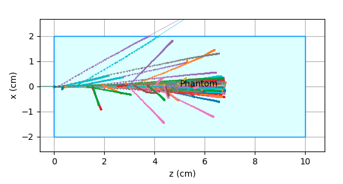

Control Options
=================================

There are many options, that can be used in an input file to control a simulation. In the list below, the default values are given.

.. index::  ! lRBE_write_DoseBio,lRBE_write_Alpha,lRBE_write_Beta,lRBE_write_RBE

.. _Radiobiology_options:

Radiobiology
~~~~~~~~~~~~~~~~~~
By default, when an RBE model is activated, FRED writes only the corresponding biological dose map.
For instance, if McNamara RBE model for protons is activated (``lRBE_McNamara=t``), then FRED will save the bio dose in ``out/RBE/DoseBio_McNamara.mhd``. Other maps can be optionally requested for checking and/or post-processing FRED output. These maps are the local alpha and beta parameters, and the RBE computed by the requested model.

    ``lRBE_write_DoseBio = t``
        write biological dose

    ``lRBE_write_Alpha = f``
        write alpha parameter

    ``lRBE_write_Beta = f``
        write beta parameter

    ``lRBE_write_RBE = f``
        write RBE values

.. _Verbosity_options:

Verbosity
~~~~~~~~~~~~~~~~~~
The level of output verbosity can be controlled in many ways, e.g. using a command line option, or an environment variable, or setting it directly in the input file.

The levels are varying from 0 (=minimal) to 5 (=debugging).

The sequence that defines the verbosity level is the following:

#. the level is set to 3 (mid verbosity)
#. level is taken from FRED_VERBOSE env variable (if present)
#. level can then be finely tuned in input file using verbose: directives
#. cmdline option -V0…-V5 override any previous settings 

.. code-block:: python

	# quick and dirty
	verbose: 0

	# equivalent form
	verbose: all 0

	# incremental on multiple lines
	verbose: 0
	verbose: delivery 1
	verbose: geometry source 3

	# oneliner
	verbose: 0 delivery 1 geometry source 3

	# quick oneliner without changing the input file
	export FRED_VERBOSE='0 delivery 1 geometry source 3'

.. index::  ! verbose:

The `verbose:` directive can be used to set the verbosity level separately for each module.
The modules that can be controlled are: `physics, delivery, plugin, source, geometry, environment, input, materials, radiobiology`.

Example of detailed manipulation of verbosity level:

.. code-block:: none

	verbose: all 0
	verbose: physics 3
	verbose: delivery 2
	verbose: plugin 5
	verbose: source 1
	verbose: geometry 3
	verbose: environment 0
	verbose: input 4
	verbose: materials 2
	verbose: radiobiology 5

.. _Other_control_options:

Other control options
~~~~~~~~~~~~~~~~~~~~~

``lplotray = bool (default = false)``
	.. index::  ! lplotray
	
	Activate/deactivate output of detailed track information for each traced particle. It can be used for geometry checking and visual debugging of a simulation using ``sceneViewerFred.py`` script.

	.. important::
		When ``lplotray=t``, the code automatically switches to **serial** execution on a single process on the CPU. Hence use it with just a few primaries per pencil beam, since the tracking rate will be very low and FRED will produce large text files containing all steps of the tracks.

    Tracks of primary and secondary particles in a water phantom irradiated by 100 MeV proton beam.

``allowOverlapping = [region1 region2 ...]``
	.. index::  ! allowOverlapping

	The directive allows to define with regions can overlap and which one is the master region to track the particles in, in case of overlap.	
	For instance, it can be useful to define the gantry regions (range shifters, extendable nozzle, etc.) overlapping with the patient CT (Phantom). In this case, the directive ``allowOverlapping: gantry phantom`` will force FRED to track particles inside the gantry region containing all the nozzle elements, even if it intersects with the patient CT, which can happen when the extendable nozzle is used and it is moved close to the patient body.
	
``ijFormatVersion = int (default = 20)``
	.. index::  ! ijFormatVersion
	
	Determines the version of the influence matrix file format. See :ref:`influenceMatrixDescription` for more details.

``lAllowHUClamping = bool (default = false)``
	.. index::  ! lAllowHUClamping
	
	TODO

``lWriteIJPerPrim = bool (default = true)``
	.. index::  ! lWriteIJPerPrim

	Normalize the influence matrix results for a given quantity per primary
	