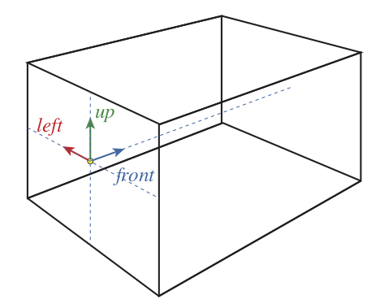

Geometry Definition
=================================

The definition of a simulation geometry includes the description of regions (range shifters, etc. ), fields, phantom and other physical parts of a simulation, that should be included in the particle tracking. All the elements of a simulation geometry are placed in **Room** region.

Region definition
------------------------------------------------------

Region is the fundamental building block for defining the geometry of a simulation. Currently, FRED is working only in Cartesian coordinate system and allows for regions with the shape of a rectangular box. A region is described by a set of parameters defining its field of reference (FoR), material, scoring and many others. Some of the parameters are mandatory, which is explicitly marked and the default parameters for the optional are given.

    ID : regionID (mandatory)
        Name or number identifying the region.

    O = [0, 0, 0]
        Origin of the region, namely the coordinates in the Room frame of the pivot point.

    pivot = [0.5,0.5,0.5]
        Origin of the region FoR in local normalized coordinates. By default, is the central point of the box.

    f = [0,0,1]
        Region front vector in the Room reference frame, i.e. components of the e\ :sub:`3` basis vector.

    u = [0,1,0]
        Region up vector in the Room reference frame, i.e. components of the e\ :sub:`2` basis vector.

    l = [1,0,0]
        Region left vector in the Room reference frame, i.e. components of the e\ :sub:`1` basis vector.

The *front*, *up*, and *left* vectors are normalized internally to unit vectors, so they can be more easily specified in input. For instance, **f=[1,1,0]** corresponds to a horizontal direction at 45° with respect to *X* and *Y* axes. Only two direction vectors can be specified, the third one is automatically determined by constructing a standard orthonormal basis. For instance, the *left* vector is determined using the cross product, i.e. *l = u x f*.

    L = [1,1,1]
        Region extent, i.e. size of the region bounding box.

    voxels = [1,1,1]
        Number of volume subdivisions along each direction.

    maxStepSize = 10
        Maximum step length allowed inside this region.

    rescale = 1
        Rescaling factor for the whole region. It can be used for instance to shrink or inflate a voxel map loaded from file.

    material = vacuum
        Definition of homogeneous region, meaning that the region will be filled with a single material.

    CTscan = filename
        Load a 3D voxel map from a CT scan with values in HU. A calibration curved is used to convert from HU to material composition and density.

    score = None
        List of scorers requested for this region. Allowed dense scorers are:

        **Edep** - map of deposited energy per primary [MeV]

        **dose** - map of deposited dose [Gy]

        **LETd** - map of dose-averaged LET [MeV/cm]

        **track** -

        **counts** -

        **None** - no scorer activated

    lWriteDensity = False
        Save the density map of the region. Can be useful when loading the region properties for a CT scan in HU, in order to check HU to density conversion.

    lWriteImat = False
        Save the imat map, i.e. the index of materials.

    lWriteLETd_parts = False
        Save the LETd numerator and denominator maps. These can be used to add the dose-averaged LET maps from multiple simulations (for instance for simulations of a single patient plan where multiple fields ware simulated separately). Than the final LETd map can be obtained by summing separately the numerators and denominators from multiple simulations, and calculating the quotient.

    lWriteCTHU = True
        Save the CTHU map. It works only when *CTscan* is given. This map is basically a copy of a CT map given in *CTscan*. The saved file is used by sceneViewerFred.py script to map a CT on scene and by mhd_overlay.py script to create a background for dose distribution.

Field definition
------------------------------------------------------

Field is a structure describing an irradiation direction of a beam-like source of particles. It is essentially the definition of a reference frame with respect to the Room frame. The front vector is the main beam direction, also known as the beam-axis. The up and left vectors are defined as in the figure below.

    Reference frame associated with a field.

A field is described with a few parameters. Some of the parameters are mandatory, which is explicitly marked and the default parameters for the optional are given.

    FID:  fieldID  (mandatory)
        Number identifying the region.

    O = [0,0,0]
        Origin of field in Room coordinates.

    f = [0,0,1]
        Field front vector (i.e. direction of propagation) in the Room reference frame.

    u = [0,1,0]
        Field up vector in the Room reference frame.

    exitWindowPlane = 0
        Distance from the source to the exit window along the front direction. Particles are transported in vacuum up to the exit window, and in the Room material after exit.

The *front* and *up* vector are normalized internally to unit vectors, so they can be more easily specified in input. For instance, **f=[1,1,0]** corresponds to a horizontal propagation direction at 45° with respect to *X* and *Y* axes.

If no fields are specified in the input file, then a field with ID=0 is created with parameters corresponding to the following line:

.. code-block:: python

    field: 0 ; O = [ 0, 0, -10]; f = [ 0, 0, 1] ; u = [ 0, 1, 0]

