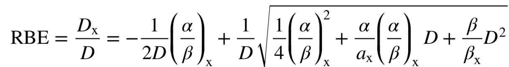

Radiobiology
=================================

FRED can compute the effective biological dose using several built-in RBE models for protons.

where the relative biological effectiveness (RBE) for proton beams is described using the linear-quadratic model

where ``(alpha/beta)x`` is the reference ratio for X-rays (see, for instance, Polster L. et al, Phys. Med. Biol. **60** (2015) 5053). 

.. index::  ! RBE_alphaX
.. index::  ! RBE_betaX

The reference values of ``alpha_X`` and ``beta_X`` can be defined in the input file (default values are shown hereafter):

.. code-block:: none

	RBE_alphaX = 0.0722	
	RBE_betaX = 0.0502

*New in version 3.70.0*

	It is possible to prescribe a different value for ``alpha_X`` and ``beta_X`` for each organ in a CT scan. You can do this by loading two maps for each region as in the following example. The values can be actually defined at the voxel level. Setting voxels to 0 will actually correspond to mask those part of the CT, and they will not be included in the final RBE calculation.

	.. code-block:: none

		region<
		    ID=phantom
		    CTscan='inp/CT_ExtROICrop_1.5x1.5x1.5.mhd'
		    score=[Dose,RBE,LETd]
		    alphaBetaX=[inp/myAlphaX.mhd,inp/myBetaX.mhd]
		region>

.. note::
	The results of RBE models (e.g. maps of RBE, Dose_Bio, alpha and beta parameters) are saved in the directory ``out/RBE`` which is created only if RBE-based calculations are requested.
	
.. index::  ! RBE_Constant

Constant RBE
------------
The most simple assumption is to consider proton RBE constant with respect to the dose level delivered to the patient. Given the complexity of the topic, the constant RBE is still a working solution adopted in many treatment centres worldwide. The typical reference value is 1.1 for protons, namely proton dose is on average 10% more effective than the same dose delivered by photons.

RBE_constant = (float)
	if set, it activates the conversion of physical dose to biological dose using the given constant value. The corresponding dose map is saved in ``out/RBE/DoseBio_Constant.mhd``.

Variable RBE models are grouped into `LETd-based` models and `Table-based` models.

LETd-based models
--------------------

The following section presents the implemented models with the default values that can be overridden in the input file.

.. hint::

	You can use the built-in models described below. It is anyhow very simple to implement new RBE models as post-processing of FRED output. For inspiration, have a look at the :ref:`python script <RBEMcNamaraModel>` in the examples that re-implements the McNamara model.

.. index::  ! lRBE_Carabe,RBE_Carabe

Carabe
^^^^^^^^^^

.. code-block:: none

	lRBE_Carabe = t # activate model

	# model parameters and default values:

	RBE_Carabe_p1 = 0.843
	RBE_Carabe_p2 = 0.154
	RBE_Carabe_p3 = 2.686
	RBE_Carabe_p4 = 1.09
	RBE_Carabe_p5 = 0.006

Reference: Carabe-Fernandez A, Dale R G and Jones B,  `The incorporation of the concept of minimum RBE (RBEmin) into the linear-quadratic model and the potential for improved radiobiological analysis of high-LET treatments`, Int. J. Radiat. Biol. **83** 27–39 (2007)

.. index::  ! lRBE_Chen,RBE_Chen

Chen
^^^^^^^^^^

.. code-block:: none

	lRBE_Chen = t # activate model

	# model parameters and default values:

	RBE_Chen_lambda1 = 0.0013
	RBE_Chen_lambda2 = 0.045
	RBE_Chen_alpha1  = 0.1

Reference: Chen Y and Ahmad S, `Empirical model estimation of relative biological effectiveness for proton beam therapy`, Radiat. Prot. Dosim. **149** 116–23 (2012)

.. index::  ! lRBE_McNamara,RBE_McNamara

McNamara
^^^^^^^^^^

.. code-block:: none

	lRBE_McNamara = t # activate model

	# model parameters and default values:

	RBE_McNamara_p0 = 0.99064
	RBE_McNamara_p1 = 0.35605
	RBE_McNamara_p2 = 1.1012
	RBE_McNamara_p3 = -0.0038703

Reference: McNamara AL, Schuemann J, Paganetti H, `A phenomenological relative biological effectiveness (RBE) model for proton therapy based on all published in vitro cell survival data.` Phys Med Biol.  **60** 8399-416 (2015)

.. index::  ! lRBE_Wedenberg,RBE_Wedenberg

Wedenberg
^^^^^^^^^^

.. code-block:: none

	lRBE_Wedenberg = t # activate model

	# model parameters and default values:
	
	RBE_Wedenberg_c1 = 0.434

Reference: Wedenberg M, Lind B K and Hardemark B, `A model for the relative biological effectiveness of protons: the tissue specific parameter alpha/beta of photons is a predictor for the sensitivity to LET changes`, Acta Oncol. **52** 580–8 (2013)

.. index::  ! lRBE_Wilkens,RBE_Wilkens

Wilkens
^^^^^^^^^^

.. code-block:: none

	lRBE_Wilkens = t # activate model

	# model parameters and default values:
	
	RBE_Wilkens_lambda = 0.02
	RBE_Wilkens_alpha0 = 0.1

Reference: Wilkens J J and Oelfke U, *A phenomenological model for the relative biological effectiveness in therapeutic proton beams*, Phys. Med. Biol. **49** 2811–25 (2004)

.. note::
	The amount of information that is saved to disk for each requested RBE model is controlled by :ref:`several flags <Radiobiology_options>`. 