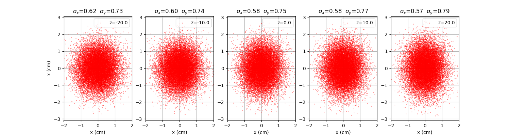

Scoring Particles
=================

    *New in version 3.70.0*

Plane Crossing scorers
----------------------

It is possible to score all particles crossing a plane surface inside the geometry setup.

An infinite plane is defined by a reference point (the origin ``O``) and a normal vector ``n``.

The **pxs:** directive is used to setup a plane crossing scorer:

    ID = (int)
        number identifying the scorer for subsequent output

    O = [0, 0, 0]
        Origin of the plane.

    n = [0,0,1]
        normal vector to the plane.

    prec = (int) 6
        floating point precision of text output

Hereafter an example of scoring particles crossing planes downstream of a field: this setup can be used to quickly check the beam propagation:

.. code-block:: none

    field: 1 ; O = [0,0,-200]; L=[40,40,1]; pivot = [0.5,0.5,0.5]

    pb: 1 1 ; particle = proton; T = 100; sigmaSqrModel = [200,0.3328,-0.00128,3.2e-05,0.555556,0.00222222,2.22222e-05]

    # define crossing planes along the beam axis
    pxs: 1; O=[0,0, -20]; n=[0,0,1]; prec = 10
    pxs: 2; O=[0,0,   0]; n=[0,0,1]; prec = 10
    pxs: 3; O=[0,0, +20]; n=[0,0,1]; prec = 10

    deactivate: phantom

    nprim=1e4

Each plane will produce a separate file in the output directory

.. code-block:: none

    out/
    └─ score
        ├─ PlaneCrossing_1.txt
        ├─ PlaneCrossing_2.txt
        ├─ PlaneCrossing_3.txt
        ├─ PlaneCrossing_4.txt
        └─ PlaneCrossing_5.txt

with all crossing events recorded by FRED, e.g.

.. code-block:: none

    # UID  PDGcode  gen x y z (cm)    cosx cosy cosz     energy (MeV)
    1767 2212 1 0.2931099832 0.09622633457 -20 0.004025272559 0.005532842129 0.9999765158 100
    2040 2212 1 -0.02017699182 -0.7830485702 -20 -0.0005401616218 -0.002020265441 0.9999977946 100
    3326 2212 1 0.4653390348 -0.2075468302 -20 -0.005163567141 -0.0006195059977 0.9999864697 100
    7875 2212 1 -0.6917120218 0.9977480173 -20 -0.000552367419 -0.006716909818 0.9999772906 100
    6010 2212 1 0.7778751254 0.5707585216 -20 -0.001501463703 0.006481928751 0.9999778867 100
    8917 2212 1 -0.5082454085 -0.1271313429 -20 0.007672127336 -0.002481081756 0.9999674559 100
    ...

where each rows corresponds to a crossing event, and a header line describes the columns. For instance, here we have the particle UID, the PDG code of the particle (2212=proton), its generation (1=primary), the hit position in global coords, the particle direction in global coords, and finally its kinetic energy.

    Particle distribution along beam axis at selected planes around ISO centre.
