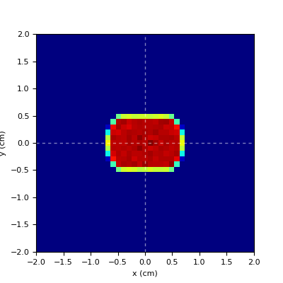

Source Definition
=================================

.. contents::

The main direction of irradiation is defined be the *field*, which identifies a frame of reference directed along the beam axis. Thinking of a active scanning device, the accelerator beam is usually deflected with respect to beam axis in order to hit a set of control points in a plane containing the isocentre. At each control point, several parameters are defining the properties of the delivered beam, e.g. the transverse size of the beam, the amount of delivered particles, the energy of the beam, and so on.

In FRED language *field* and *beam* are synonyms, and the same is true for *pencil beam* and *beam spot*.
The pencil beam allows to finely tune all the relevant parameters needed for reproducing a complete irradiation plan (a.k.a. RTPLAN).

The hierarchical structure of fields and pencil beams can be represented in this way

.. code-block:: none

    Field_1
    ├── PB_1
    └── PB_2
    Field_2
    ├── PB_1
    ├── PB_2
    └── PB_3
    Field_3
    └── PB_1

where each field has many pencil beams.
A field can be moved around the phantom using the transform: directive. When a field moves, it rigidly brings together all belonging pencil beams. For this reason, the geometrical properties of a pencil beam are defined in the FoR of the referenced field, and not in the Room.

.. index::  ! pbParticle,pbE,pbEu,pbPSpread,pbESpread,pbXsec,pbFWHM,pbFWHMx,pbFWHMy,pbFWHMa,pbRmin,pbRmax

The `Quick and dirty` setup
------------------------------
Using the default setup (i.e. using Field_0), it is possible to quickly explore the main parameters used to describe a pencil beam (or spot). This approach is recommended for quickly gaining control on how to instruct FRED to deliver particles to a target. In the default setup, Field_0 has a single pencil beam that propagates on-axis, so that actually it is possible to identify the pencil beam with the field itself.

    pbParticle = particleID
        type of primary particles delivered by the beam

        `default = proton`

    pbE = (float) [MeV]
        pencil beam energy

        `default = 100 MeV`

    pbEu = (float) [MeV/u]
        pencil beam energy per atomic mass unit (a.k.a. `per nucleon`)

    pbPSpread = (float)
        fractional momentum spread (FWHM of a gauss distrib)

        `default = 0`

    pbESpread = (float)
        fractional energy spread (FWHM of a gauss distrib)

        `default = 0`

    pbXsec = mode
        cross-section distribution:

        pin|dot
            pin-like (pbFWHM=0) |pin|

        square|box|rect
            uniform square of side = pbFWHM |square|

            rectangular distribution if pbFWHMx!=pbFWHMy |rect|

        disc|circle|ellipse
            uniform disc with diameter = pbFWHM  |disc|

            elliptical distribution if pbFWHMx!=pbFWHMy |ellipse|

        gauss
            gaussian distribution with FHWM = pbFHWM |gauss|

            bivariate distribution if pbFWHMx!=pbFWHMy |bivariate|

    pbFWHM = (float)
        FHWM parameter for cross section distribution (both x and y)

        `default = 0`

    pbFWHMx = (float)
        FHWM parameter for cross section distribution (along x)

        `default = 0`

    pbFWHMy = (float)
        FHWM parameter for cross section distribution (along y)

        `default = 0`

    pbFWHMa = (float)
        rotation angle [deg] of transverse plane for cross section distribution |alpha|

        `default = 0`

    pbRmin = (float)
        particles are generated for r>=pbRmin in the radial direction |hollow|

        `default = 0`

    pbRmax = (float)
        particles are generated for r<=pbRmax in the radial direction |clipped|

        `default = inf`

.. |rect| image:: images/Xsec_rect.png
  :width: 70
  :alt: rectangular distribution

.. index::  ! pencil beam, pb:

The pencil beam
------------------------------
The `pencil beam` (or spot, beamlet, etc.) describes the properties of a directed source of particles.
Each PB is identified by a unique ID and belongs to a given Field.

The position and direction of the PB are given in the FoR of the referenced Field.

The PB parameters can be grouped on the basis of controlled quantity:

*   :ref:`particle_type`
*   :ref:`energy_momentum`
*   :ref:`pos_dir`
*   :ref:`cross_section`
*   :ref:`beam_envelope`

A pencil beam definition starts with the **pb:** directive. Also the multiline syntax **pb< .. pb>** can be used.

.. code-block:: none

    pb: 1 1 ; particle = proton; T = 150; Xsec = gauss; FWHM = 0.5; ...

Some of the parameters are mandatory, which is explicitly marked and the default parameters for the optional are given.

    PBID : pencil beam ID (mandatory)
        Number (or name) identifying the pencil beam.

    FID : referenced field ID (mandatory)
        Number (or name) identifying the referenced field.

    .. important::
        Please pay attention to the syntax of pb: directive

        ``pb: PBID FID ; ...``

        The mandatory parameters ``PBID`` and ``FID`` must be separated by space, then the list of semicolon-separated optional parameters follows

.. _particle_type:

Particle type and number
""""""""""""""""""""""""

    particle = (particle name) [proton]
        particle type to be delivered (a.k.a. primary particle). Check the list of available particles using ``fred -particles``

    N = (float) [1]
        actual no of primary particles delivered by the pencil beam (a.k.a. fluence). By default this no is 1, so that the corresponding dose map is `per primary`

    nprim = (#) [1e4 = 10000]
        no of Monte Carlo histories to be simulated. This sets the level of statistics used to reproduce the mean dose map of the pencil beam.

.. _energy_momentum:

Energy and momentum
""""""""""""""""""""""""
    T = (float) [100]
        (mean) kinetic energy of primary particles [MeV].

    Tu = (float)
        (mean) kinetic energy of primary particles per unit mass [MeV/u].

    ESpread = (float) [0]
        fractional energy spread (FWHM of a gauss distrib)

    pSpread = (float) [0]
        fractional momentum spread (FWHM of a gauss distrib)

.. important::
    Redefinition of some parameters and choice of energy distribution.

    *New in version 3.59.0*

    E | Emean = (float) [100]
        (mean) kinetic energy of primary particles [MeV].

    Eu | Eumean = (float)
        (mean) kinetic energy of primary particles per unit mass [MeV/u].

    Espread = (float) [0]
        fractional energy spread (FWHM of a gauss distrib)

.. figure:: images/Edistributions.png
    :alt: energy distributions
    :align: center
    :width: 75%

    Energy distributions.

.. important::
    Line source (default)
        *New in version 3.59.0*

    - Edistrib =  line | monoenergetic | monochromatic
        Particle energy is constant (line source).

        *Note: any other energy distribution with zero width will automatically fall back to the monoenergetic source.*

    - E | Emean | Eu | Eumean
        kinetic energy of primary particles [MeV or MeV/u].

.. important::
    Gaussian source
        *New in version 3.59.0*

    - Edistrib = gauss | gaussian
        Particle energy is sampled from a gaussian distribution.
        
        The distribution is defined by its mean value and its width.

        The width is defined using the following alternatives: the standard deviation, the FHWM or the fractional spread.

        

    - E | Emean | Eu | Eumean
        mean kinetic energy of primary particles [MeV or MeV/u].

    - Estdev | Eustdev
        standard deviation of gaussian energy distribution [MeV or MeV/u].

    - EFWHM | EuFWHM
        FWHM of gaussian energy distribution [MeV or MeV/u].

    - Espread
        fractional energy spread (FWHM of the gaussian distrib)

    - Emin | Eumin =0 ; Emax | Eumax = inf
        sampling range [MeV or MeV/u]. 

        Portions of a gaussian distribution can be sampled by redefining the default range.

.. important::
    Uniform source
        *New in version 3.59.0*

    - Edistrib = uniform | flat | box | rect
        Particle energy is sampled from a uniform distribution.

        The distribution range can be defined in two alternative ways, using *Emean* and *EFWHM* or specifying the range with *Emin* and *Emax*.

    - E | Emean | Eu | Eumean
        mean kinetic energy of primary particles [MeV or MeV/u].

    - EFWHM | EuFWHM
        FWHM of energy distribution [MeV or MeV/u].

    - Emin | Eumin ; Emax | Eumax
        sampling range [MeV or MeV/u].

.. _pos_dir:

Position and direction
""""""""""""""""""""""""

    P = [0, 0, 0]
        Position of the PB with the respect to its field. By default the PB is positioned at field origin.

    v = [0,0,1]
        Direction of PB with the respect to its field. By default the PB is directed parallel to the field.
        This vector is normalized internally to a unit vector.

..  _cross_section:

Transverse distribution  (a.k.a. cross-section)
""""""""""""""""""""""""""""""""""""""""""""""""""

    Xsec = (name) [pin]
        available options are

        *   pin|dot
                pin-like (FWHM=0)

        *   square|box|rect
                uniform square of side = FWHM

                rectangular distribution if FWHMx!=FWHMy

        *   disc|circle|ellipse
                uniform disc with diameter = FWHM

                elliptical distribution if FWHMx!=FWHMy

        *   gauss
                gaussian distribution with FHWM = FHWM

                bivariate distribution if FWHMx!=FWHMy

        *   uparrow
                a distribution shaped like an arrow pointing in the up direction. It can be used to check alignment and that the field frame of reference is as expected.

    FWHM = (float)  [0]
        FHWM parameter for cross section distribution (both x and y)

    FWHMx = (float)  [0]
        FHWM parameter for cross section distribution (along x)

    FWHMy = (float) [0]
        FHWM parameter for cross section distribution (along y)

    alpha = (float)  [0]
        rotation angle [deg] of transverse plane for cross section distribution

    rmin = (float)  [0]
        particles are generated for r>=rmin in the radial direction

    rmax = (float)  [inf]
        particles are generated for r<=rmax in the radial direction

    Demo of spot cross-section manipulation can be found in :ref:`this example <spots_gallery>`.

.. _beam_envelope:

Beam envelope propagation
""""""""""""""""""""""""""""""
Three models can be used to describe the evolution of spot size (i.e. its cross-section) along the propagation direction: paraxial, virtual point source and emittance model.

    Beam envelope models

By default the propagation is paraxial, namely the particles are propagating along the pencil beam axis. In paraxial mode, the spot size of the beam is constant (see red line in the Figure above).

The Virtual point Source Distribution (VSD) describes a source of particles emitted by a point in space and expanding along the propagation direction with constant divergence (the green line in the Figure corresponds to a virtual source located at x=-100 cm).

The emittance model describes the propagation of a gaussian beam in absence of active elements (deflecting magnets or focussing quadrupoles). It can be used to describe the beam propagation in the last track of an accelerator beamline. In the Figure, the blue line shows a beam focussing and then defocussing, with the minimum spot size at x = 0 cm, also called the beam waist position.

.. toctree::

   Source Virtual Point Source
   Source Emittance

