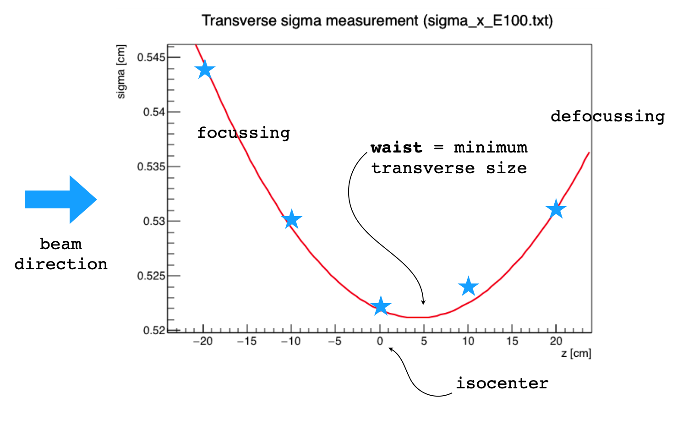
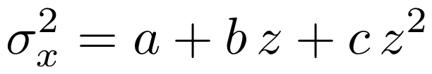
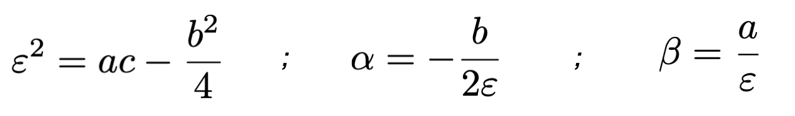
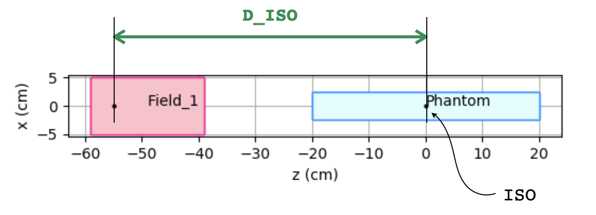
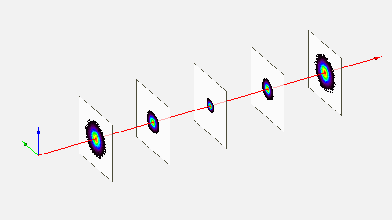
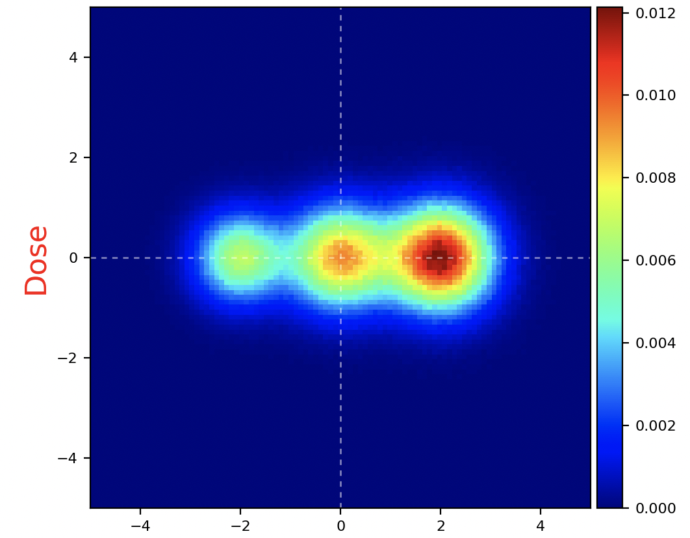

.. index:: ! sigma squared model

.. _sigsqr_model:

Sigma Squared model
------------------------------

This is a *simplified* and *user-friendly* model that allows to directly import spot size measurements into a Fred simulation.
As the name is describing, the model is based on fitting the beam spot size using a second order polynomial, as described in the emittance model section:

Let's take as a reference the case described by the following plot, showing the spot size measurements (blue stars) in the *x* direction taken at 5 different positions around the isocenter for a 100 MeV beam in a cyclotron facility.

By fitting a parabolic function through the squares of the measured points

we can obtain the parameters needed for the emittance model

Example of a simple calculation in python using the measurements of previous Figure

.. code-block::

    from math import *
    import numpy as np
    import matplotlib
    matplotlib.use('TkAgg')
    import pylab as plt

    zmeas = np.array([-20,-10,0,10,20])
    sigmeas = np.array([0.544,0.530,0.522,0.524,0.531])

    [[c,b,a],cov] = np.polyfit(zmeas,sigmeas*sigmeas,2,cov=True)

    print('a=',a)
    print('b=',b)
    print('c=',c)

    zmodel = np.linspace(np.min(zmeas),np.max(zmeas),400)
    sigmasqr = a+b*zmodel+c*zmodel*zmodel

    plt.ion()
    plt.plot(zmodel,np.sqrt(sigmasqr),'-r',label='sigma squared model')
    plt.plot(zmeas,sigmeas,'*b',label='data',markersize=10)
    plt.legend()
    plt.ylim(0,0.8)
    plt.grid()
    plt.xlabel('beam axis coordinate (cm)')
    plt.ylabel('spot size (cm)')
    plt.show()

    input('return')

which gives in output

.. code-block::

    a= 0.27326425714285724
    b= -0.0003427399999999939
    c= 3.9535714285714174e-05

.. important::

    In the previous example, the parameters have been obtained with respect to the isocenter position which is at coordinate z=0 cm  along the propagation direction. Since particles are generated in the field FoR, we have to inform FRED of the distance from field origin to the isocenter in order to have the correct spot size evolution along the beam axis. To this purpose, we define ``D_ISO`` has the distance of pencil beam origin and the isocenter.

sigmaSqrModel = [D_ISO, aX, bX, cX, aY, bY, cY]
    D_ISO : distance (cm) from pencil beam origin to ISO center plane

    aX, bX, cX : interpolation parameters for sigma_x as described above

    aY, bY, cY : interpolation parameters for sigma_y as described above

    parmeters for Y are optional: if not present, the values of X are mirrored

The input lines for source definition using the sigma `squared model model` syntax are

.. code-block::

    field: 1 ; O = [0,0,-55]; L=[10,10,20]; pivot = [0.5,0.5,0.2]

    pb: 1 1 ; particle = proton; T = 100; sigmaSqrModel = [55,0.27326425714285724,-0.0003427399999999939,3.9535714285714174e-05]

The evolution of beam cross section using the sigma squared model is represented by the following Figure

.. note::

    The sigma squared model overrides any previous declaration concerning the beam envelope such as `Xsec` or `FWHM`. So these parameters are not needed and can be undefined.

Examples
--------

Single-line input
"""""""""""""""""
Three spots using **pb:** directive in single-line mode:

.. code-block::

    region: phantom; L=[10,10,0.1]; voxels=[101,101,1]; pivot=[0.5,0.5,0]; material=PMMA

    field: 1 ; O = [0,0,-200] ; L = [20,20,2] ; pivot = [0.5,0.5,0.5]

    pb: 1 1; particle=p; E=70; N=1e7; v=[-2,0,200]; sigmaSqrModel=[200,0.36343,0.00294,0.00004731]
    pb: 2 1; particle=p; E=80; N=2e7; v=[ 0,0,200]; sigmaSqrModel=[200,0.47652,0.00285,0.00004755]
    pb: 3 1; particle=p; E=90; N=3e7; v=[+2,0,200]; sigmaSqrModel=[200,0.49745,0.00300,0.00004342]

Column-mode input using pbmaster
""""""""""""""""""""""""""""""""
Three spots using **pbmaster:** directive to define common parameters, e.g. field to ISO distance. Equivalent to previous example, but more compact. Useful when dealing with thousands of PBs, for instance in a patient treatment plan.

.. code-block::

    region: phantom; L=[10,10,0.1]; voxels=[101,101,1]; pivot=[0.5,0.5,0]; material=PMMA

    field: 1 ; O = [0,0,-200] ; L = [20,20,2] ; pivot = [0.5,0.5,0.5]

    pbmaster: 1 ; particle=p; sigmaSqr_D_ISO=200; v.z=200; columns=[E,N,v.x,v.y,sigmaSqr_aX,sigmaSqr_bX,sigmaSqr_cX]

    pb: 1 1 70 1e7 -2 0 0.36343 0.00294 0.00004731
    pb: 2 1 80 2e7  0 0 0.47652 0.00285 0.00004755
    pb: 3 1 90 3e7 +2 0 0.49745 0.00300 0.00004342

The parameters that you can predeclare in the **pbmaster:** directive have to following names: ``sigmaSqr_D_ISO,sigmaSqr_aX,sigmaSqr_bX,sigmaSqr_cX,sigmaSqr_aY,sigmaSqr_bY,sigmaSqr_cY``.
