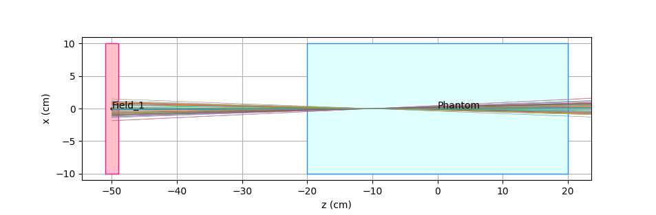

Virtual Point Source model
------------------------------

In the Virtual Point Source model, primary particles are distributed as if they were emitted by a point source. The user can prescribe a transverse distribution using ``Xsec`` (e.g. gaussian, uniform box, etc.) at a given plane downstream. This plane is called *reference plane* and usually in clincal applications corresponds to the ISO plane. Particle trajectories are originating from a point on the beam axis that is located at *virtual source distance* (VSD) from field origin. Initial positions of particles are extrapolated to the field origin plane. The following schetch clarifies the procedure.

Input parameters
""""""""""""""""

    VSD : (float) [0]
        Virtual Source Distance from field origin along beam direction (field f), downstream if >0, upstream if <0

    refPlaneDistance : (float) [0]
        distance from field origin of the plane where particles are distributed according to Xsec and FWHM parameters

    VSDx,VSDy : (float)
        Virtual Source Distance from field origin along x and y directions (field left and up); the source is astigmatic, i.e. focussing down to a point at different positions along x and y

.. note::

    If VSD == refPlaneDistance, then the source becomes a paraxial source, i.e. particles are propagating parallel to beam axis

Examples
--------

Virtual Point Source (VPS) at the field origin, FWHM = 4 cm at ISO plane, with uniform disc transverse distribution.

.. code-block::

    region: phantom; L=[20,20,40]; voxels=[201,201,80]; pivot=[0.5,0.5,0.5]; material=air

    field: 1 ; O = [0,0,-50] ; L = [20,20,2] ; pivot = [0.5,0.5,0.5]

    pb: 1 1; particle=p; E = 150; Xsec=disc; FWHM=4; refPlaneDistance=50

VPS downstream of field origin

.. code-block::

    region: phantom; L=[20,20,40]; voxels=[201,201,80]; pivot=[0.5,0.5,0.5]; material=air

    field: 1 ; O = [0,0,-50] ; L = [20,20,2] ; pivot = [0.5,0.5,0.5]

    pb: 1 1; particle=p; E = 150; Xsec=disc; FWHM=4; refPlaneDistance=50; VSD=20

VPS upstream of field origin

.. code-block::

    region: phantom; L=[20,20,40]; voxels=[201,201,80]; pivot=[0.5,0.5,0.5]; material=air

    field: 1 ; O = [0,0,-50] ; L = [20,20,2] ; pivot = [0.5,0.5,0.5]

    pb: 1 1; particle=p; E = 150; Xsec=disc; FWHM=4; refPlaneDistance=50; VSD=-20

Beam focussing at ISO

.. code-block::

    region: phantom; L=[20,20,40]; voxels=[201,201,80]; pivot=[0.5,0.5,0.5]; material=air

    field: 1 ; O = [0,0,-50] ; L = [20,20,2] ; pivot = [0.5,0.5,0.5]

    pb: 1 1; particle=p; E = 150; Xsec=disc; FWHM=4; refPlaneDistance=0; VSD=50

Astigmatic beam focussing at +/- 10 cm with respect to ISO

.. code-block::

    region: phantom; L=[20,20,40]; voxels=[201,201,80]; pivot=[0.5,0.5,0.5]; material=air

    field: 1 ; O = [0,0,-50] ; L = [20,20,2] ; pivot = [0.5,0.5,0.5]

    pb: 1 1; particle=p; E = 150; Xsec=disc; FWHM=4; refPlaneDistance=0; VSDx=40; VSDy=60;

