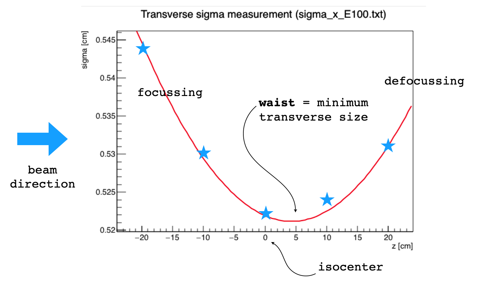
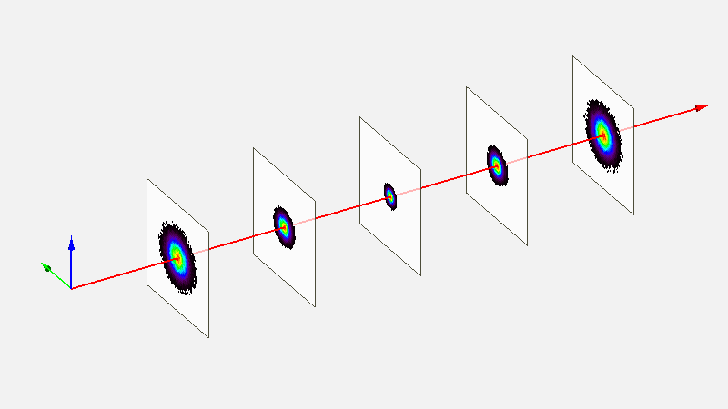

.. index:: ! emittance model

Emittance model
------------------------------

.. contents::

In the emittance model the evolution of the spot size can be described using the Twiss parameters

where the square of the std deviation :math:`\sigma_x^2` along :math:`x`  is a quadratic function of propagation coordinate :math:`z`.

The model parameters are the emittance :math:`\varepsilon`, and the Twiss parameters :math:`\alpha` and :math:`\beta`.

To use the emittance model, the following parameters must be set in a pencil beam definition:

.. index:: emittanceX,twissAlphaX,twissBetaX
.. index:: emittanceY,twissAlphaY,twissBetaY
.. index:: emittanceRefPlaneDistance

Xsec = emittance
	activate the emittance model: the cross-section is automatically a bivariate gaussian distribution

emittanceX = (float)
	emittance along x

twissAlphaX = (float)
	Twiss alpha along x

twissBetaX = (float)
	Twiss beta along x

emittanceY = (float) [emittanceX]
	emittance along y

twissAlphaY = (float) [twissAlphaX]
	Twiss alpha along y

twissBetaY = (float) [twissBetaX]
	Twiss beta along y

emittanceRefPlaneDistance = (float)
	distance from beam origin of the reference plane where the previous parameters have been calculated

The spot size is usually measured in air inside a treatment room during the commissioning procedure or a QA protocol. For instance, the following plot shows the measurements (blue stars) taken at 5 different positions around the isocenter for a 100 MeV beam in a cyclotron facility.

By fitting a parabolic function through the squares of the measured points 

.. figure:: images/sigma2_fit_function.png
    :alt: fit function
    :align: center
    :width: 40%

we can obtain the parameters needed for the emittance model

.. figure:: images/fit_to_emittance.png
    :alt: fit to emittance
    :align: center
    :width: 60%

Example of a simple calculation in python using the measurements of previous Figure

.. code-block::
	
	from math import *
	import numpy as np

	zmeas = np.array([-20,-10,0,10,20])
	sigmeas = np.array([0.544,0.530,0.522,0.524,0.531])

	[[c,b,a],cov] = np.polyfit(zmeas,sigmeas*sigmeas,2,cov=True)

	eps = sqrt(a*c-b*b/4)
	alpha=-b/2/eps
	beta=a/eps

	print('epsilon=',eps)
	print('alpha=',alpha)
	print('beta=',beta)	

which gives in output

.. code-block::
	
	epsilon= 0.0032824274429144556
	alpha= 0.05220831320123199
	beta= 83.25066186389999

.. important::
	
	In the previous example, the parameters have been obtained with respect to the isocenter position which is at coordinate z=0 cm  along the propagation direction. Since particles are generated in the field FoR, we have to inform FRED of the distance from field origin to the isocenter in order to have the correct spot size evolution along the beam axis. To this purpose, we have to use the ``emittanceRefPlaneDistance`` parameter.

Finally, the input lines for source definition are

.. code-block::
	
	field: 1 ; O = [0,0,-55]; L=[10,10,20]; pivot = [0.5,0.5,0.2]

	pb<
		ID = 1 ; FID = 1
		particle = proton
		T = 100 # MeV
		Xsec = emittance

		twissAlphaX=0.05220831320123199
		twissBetaX=83.25066186389999
		emittanceX=0.0032824274429144556

		emittanceRefPlaneDistance=55; # Field_1 origin is at 55 cm from ISO		
	pb>

The evolution of beam cross section using the emittance model is represented by the following Figure

