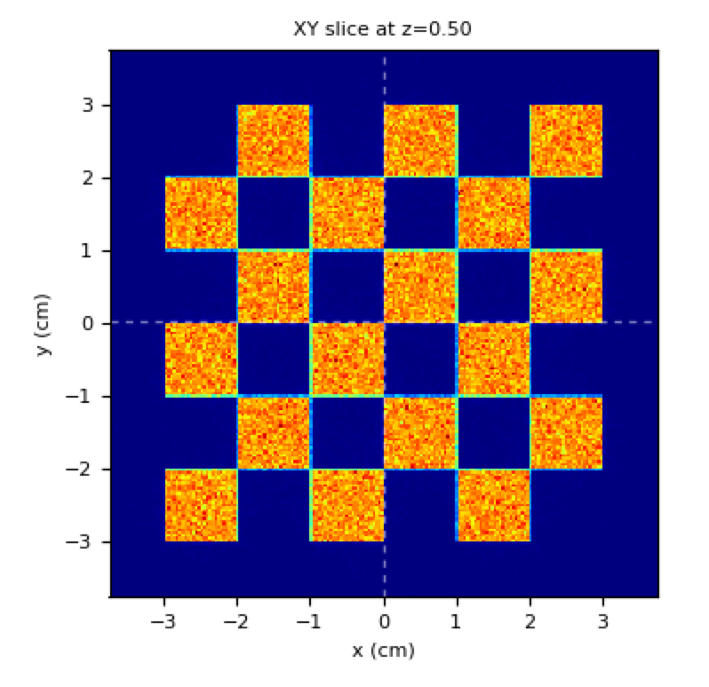

.. _chessboard:

Chessboard irradiation pattern
=================================

Purpose: to show usage of :ref:`python preparser with meta-input code <python_meta_input>`.

Note the nested **for** loops and the conditional **if**.

**Meta-input file**

.. literalinclude:: chessboard.inp

The python preparser generates the following input file (look into  ``out/log/run.inp``):

.. literalinclude:: run.inp

Results:

    here the technique is to keep fixed the phantom and move the beam at each spot

    The resulting irradiation pattern on the phantom looks like:

    Chessboard-like irradiation pattern (lin scale)
