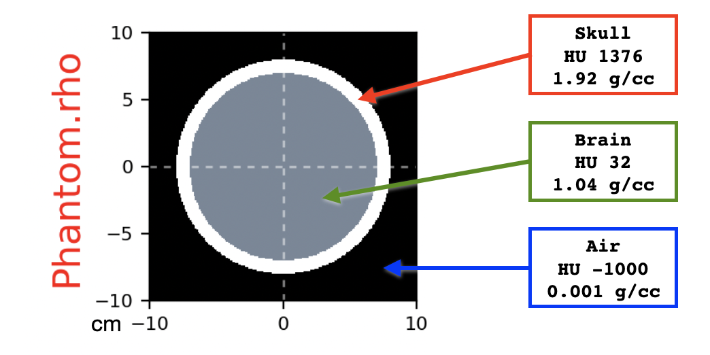
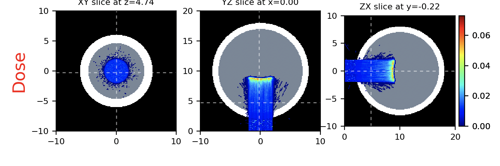

.. _overriding_materials:

Overriding materials
====================

    *Since version >= 3.75*

Purpose: to show usage of **override:** directive for replacing materials in a voxelized region using ROIs.

We create a synthetic CT consisting of a spherical skull filled with brain material.
The skull is a spherical wall of cortical bone 1 cm thick. The skull is surrounded by air.
We nicknamed this setup as `the Mental Ball`.

The input file looks like:

.. literalinclude:: override.inp

    Density map of the `Mental Ball`

Explanation of the procedure:

#. load a CT scan into the Phantom region
#. set air (HU -1000) outside a sphere of radius 8 cm
#. set cortical bone (HU +1376) inside the same sphere
#. replace with brain (HU +32) a sphere of radius 7 cm

Delivering the beam, we obtain the following dose map

.. important::

    the ``override:`` rules are applied in the order they are found in the input file

.. hint::
    
    It is possible to mix standard and HU materials. For instance:
    
    .. code-block:: python

        override: phantom air    outside Sphere8cm.mha
        override: phantom HU1300 inside  Sphere8cm.mha
        override: phantom HU32   inside  Sphere7cm.mha

    or 

    .. code-block:: python
    
        override: phantom vacuum  outside Sphere8cm.mha
        override: phantom Al      inside  Sphere8cm.mha
        override: phantom water   inside  Sphere7cm.mha

**Python script for generating the synthetic CT and the ROIs for the `Mental Ball`**

    The following python script shows how to generate a synthetic CT and two ROIs.
    The ROIs are two filled spheres with a radius of 8 and 7 cm respectively.

.. literalinclude:: mentalBall.py
