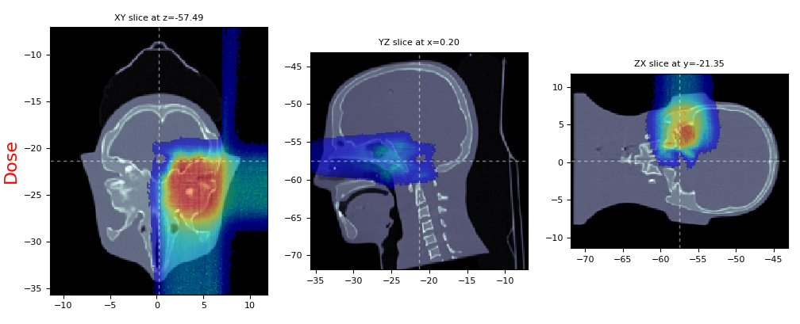

Patient Workflow
=================================

A simple patient workflow simulation and analysis. The already simulated example can be downloaded using the link below.

.. only:: builder_html

	:download:`Patient Workflow <PatientWorkflow.zip>`.

The example consists of:

- **GenericBeamModel.bm** - beam model describing a proton scanning pencil beam with the emittance lateral propagation model and a single range shifter block. The model can be read by `FREDtools  <https://fredtools.ifj.edu.pl/>`_.
- **CT.mhd** - 3D CT image in Meta-Image format. The image can be prepared by conversion and modification of a DICOM CT set. The `FREDtools  <https://fredtools.ifj.edu.pl/>`_ consists of all the necessary implementations for this purpose.
- **RN.dcm** - DICOM treatment plan describing all the fields and pencil beams energies and positions. The plan can be converted to FRED input files described below with so-called *getPlan* script. Contact the FRED developers for more information.
- **fred.inp** - the main FRED input file that defines the simulation setting and calls other files. 
- **materials.inp** - the FRED input file defining the range shifter material.
- **regions.inp** - the FRED input file defining the range shifter geometry.
- **rtplan.inp** - the FRED input file defining the pencil beams, including their energies, propagation, position, and fields' rotations, i.e. gantry and couch rotations. 

The example can be run by simpy:

.. code-block:: bash

    $ fred -f fred.inp

The dose distribution overlapped wit the CT can be visualized with:

.. code-block:: bash

    $ mhd_viewer.py -CT CT.mhd out/Dose.mhd -DCO 0.1

which enables to inspect the dose distribution.

    Dose-Phantom overlay

