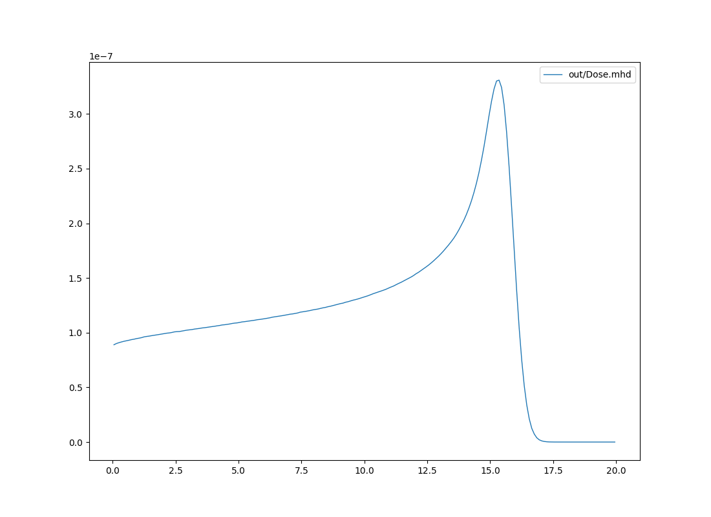

Pencil beam in water phantom
=================================

A simple simulation of a single pencil beam in water. The setup and the method presented in this example can be used to validate and optimize the initial energetic parameter of the pencil beam.

Input file
----------------------------------------

The beam is defined by means of an emittance model with parameters corresponding to the beam sizes of 0.5, 0.3, 0.2, 0.4, and 0.8 |nbsp| cm (sigma) at distances from the isocentre of -20, -10, 0, 10 and 20 |nbsp| cm, respectively. The distance from the source to the isocentre and to the phantom is 40 cm. The dose is scored in a water phantom of size 10x10x20 |nbsp| cm\ :sup:`3` with pixel size 1x1x1 |nbsp| mm\ :sup:`3`. The initial energy is defined as a Gaussian distribution with the mean energy of 150 MeV and FWHM of 5 MeV.

.. code-block:: python

    ### Phantom ###
    region<
        ID=Phantom
        O=[ 0, 0, 0 ]
        f=[ 0, 0, 1 ]
        u=[ 0, 1, 0 ]
        L=[ 10, 10, 20 ]
        pivot=[ 0.5, 0.5, 0 ]
        voxels=[ 100, 100, 200 ]
        material=water
    region>

    ### Beam ###
    field: 1 ; O = [0,0,-40]; L=[10,10,20]; pivot = [0.5,0.5,0.2]
    pb<
        ID = 1
        fieldID = 1
        particle = proton
        Emean = 150 # Mean energy in MeV
        EFWHM = 5 # Energy spread as FWHM of a Gaussian distribution in MeV

        Xsec = emittance

        # the Twiss parameters corresponding to the beam sizes of 0.5, 0.3, 0.2, 0.4, and 0.8 cm (sigma)
        # at distances from the ISO of -20, -10, 0, 10 and 20 cm, respectively
        twissAlphaX=-1.235900963624794
        twissBetaX=8.3916636857885
        emittanceX=0.0034387868648755714

        emittanceRefPlaneDistance=40; # Field_1 origin is at 40 cm from ISO
    pb>

    nprim=1e6

Simple analysis
-------------------------------------

.. code-block:: bash

    $ mhd_sliceint.py out/Dose.mhd -p

    Bragg peak in water (integrated depth dose - IDD).

