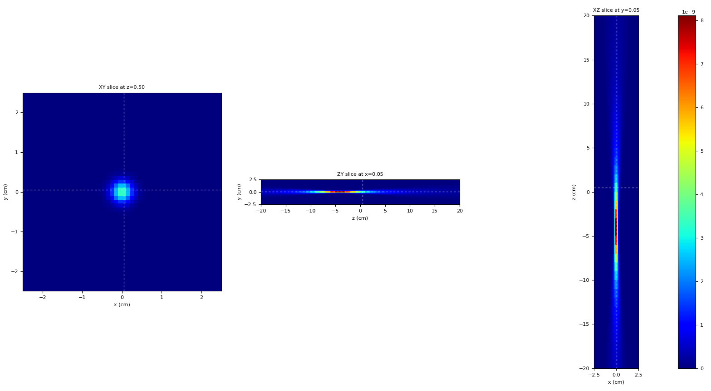

Pencil beam in air
=================================

A simple simulation of a single pencil beam in air. The setup and the method presented in this example can be used to validate the lateral propagation of a single pencil beam in the air. It is helpful for the validation and optimization of beam envelope propagation. In this example, an emittance model is used, and the description can be found in :ref:`emittance_model`.

Input file
----------------------------------------

The beam is defined by means of an emittance model with parameters corresponding to the beam sizes of 0.5, 0.3, 0.2, 0.4, and 0.8 |nbsp| cm (sigma) at distances from the isocentre of -20, -10, 0, 10 and 20 |nbsp| cm, respectively. The distance from the source to the isocentre is 40 cm. The dose is scored in an air phantom of size 5x5x40 |nbsp| cm\ :sup:`3` with pixel size 1x1x10 |nbsp| cm\ :sup:`3` . The material of the phantom is inherited from the air and changes the radiation length to a large value to minimize the effect of multiple coulomb scattering (MCS). This is required when the measurements of the lateral beam sizes are performed in air.

.. code-block:: python

    ### Phantom ###
    region<
        ID=Phantom
        O=[ 0, 0, -20 ]
        f=[ 0, 0, 1 ]
        u=[ 0, 1, 0 ]
        L=[ 5, 5, 40 ]
        voxels=[ 50, 50, 40 ]
        material=airNOMCS # material with no MCS effect
    region>

    ### Beam ###
    field: 1 ; O = [0,0,-40]; L=[10,10,20]; pivot = [0.5,0.5,0.2]
    pb<
        ID = 1
        fieldID = 1
        particle = proton
        T = 150 # MeV
        Xsec = emittance

        # the Twiss parameters corresponding to the beam sizes of 0.5, 0.3, 0.2, 0.4, and 0.8 cm (sigma)
        # at distances from the ISO of -20, -10, 0, 10 and 20 cm, respectively
        twissAlphaX=-1.235900963624794
        twissBetaX=8.3916636857885
        emittanceX=0.0034387868648755714

        emittanceRefPlaneDistance=40; # Field_1 origin is at 40 cm from ISO
    pb>

    nprim=1e6

    ### Materials ###
    material<
        ID=airNOMCS
        longName ='air without MCS'
        basedOn = air
        rho = 1.205e-3
        Lrad = 1e32 # high radiation length is set to minimize the impact of MCS
    material>

Simple analysis
-------------------------------------

.. code-block:: bash

    $ mhd_viewer.py out/Dose.mhd

    Dose deposition in air.
