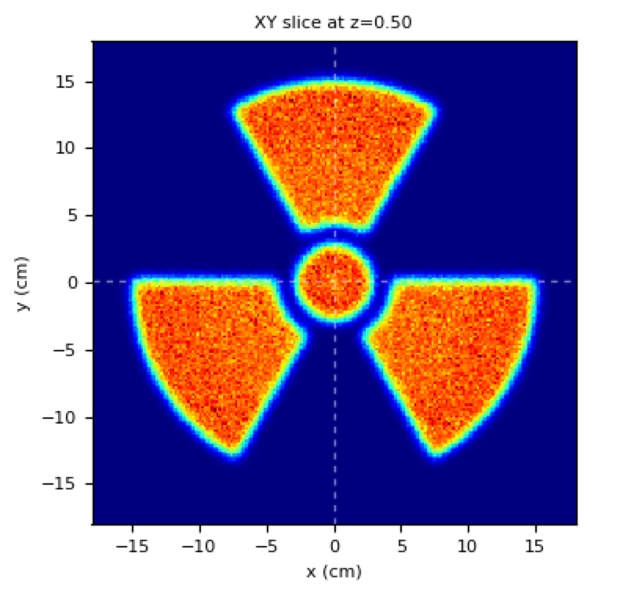

Radiation Hazard Sign irradiation pattern
=========================================

Purpose: to show usage of :ref:`python preparser with meta-input code <python_meta_input>`.

Note how to programmatically build a complex rtplan.

**Meta-input file**

.. literalinclude:: radiation_hazard.inp

The python preparser generates the following input file (look into  ``out/log/run.inp``):

.. literalinclude:: run.inp

Results:
    
    The generated *rtplan* has a few thousands spot. 

    The resulting irradiation pattern on the phantom looks like:

    Radiation Hazard Sign irradiation pattern (lin scale)
