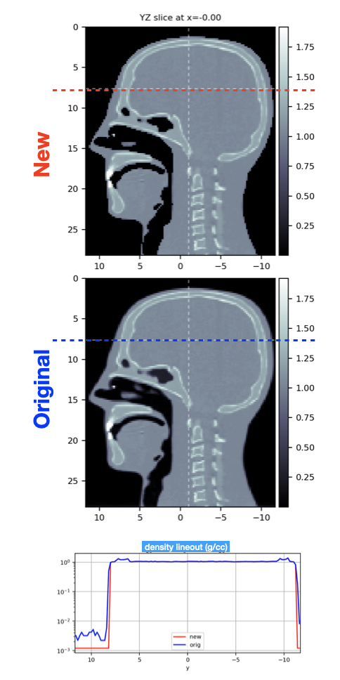

.. _reassignHU_materials:

Reassign HU materials
=====================

    *Since version >= 3.75.10*

Purpose: to show usage of **reassignHU:** directive for reassigning HU materials in a given range to a new material.

The syntax of the directive is:

**reassignHU:**

    .. code-block:: python

        reassignHU: region material HUmin [HUmax]

    where

        *region* is the target region to modify

        *material* is the new material to assign

        *HUmin* is the minimum HU value

        *HUmax* is the maximum HU value (optional; default = HUmin)

    All voxels with HU value in the given range, i.e. HUmin <= HU <= HUmax, are assigned the new material.

    The new material can be a standard material (such as air, water, PMMA, etc.) or an HU material (such as HU-500 or HU+1300).

    Example:

    assign to air all voxels with HU in the range [-1000,-300]

    .. code-block:: python

        reassignHU: phantom air -1000 -300

Here an example where we use the built-in MrHead CT and change voxels in the low HU band to standard air:

.. literalinclude:: reassign.inp

    Density maps before (orig) and after (new) reassignment.

.. important::

    the ``reassignHU:`` rules are applied in the order they are found in the input file

