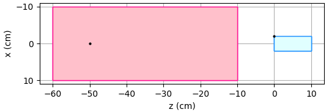
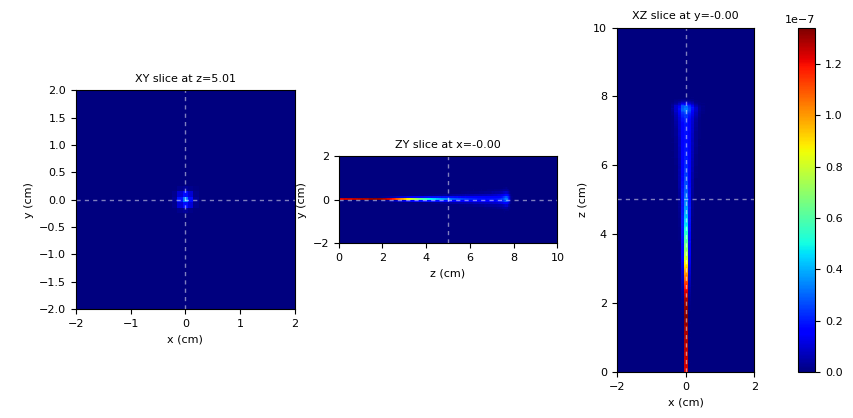
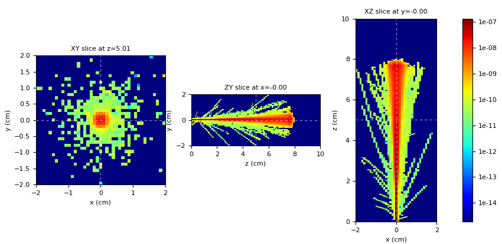
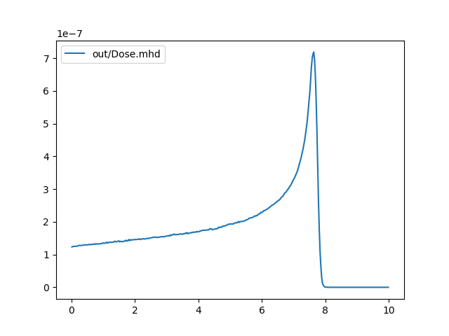

Simple simulation and analysis
=================================

A quick and simple simulation to start with FRED simulations or to test a new installation can be run using a default setup. To get the default setup, just run FRED with an empty input file. All parameters are then set to their default value, as described hereafter.

1. Create a new folder, where the simulation is running, and enter to it:

.. code-block:: bash

    $ mkdir fredSim
    $ cd fredSim

2. Create an empty input file:

.. code-block:: bash

    $ touch fred.inp

3. Run simulations:

.. code-block:: bash

    $ fred

Default setup description
----------------------------------------

The default setup corresponds to a proton beam hitting a water box. The default field is **Field_0** propagating along *Z*. There is a single pencil beam directed along the field axis and consisting of monoenergetic 100 MeV protons. The FWHM of the pencil beam is 0, i.e. it is a pin-like beam of perfectly aligned particles. The **Phantom** is a 4x4x10 |nbsp| cm\ :sup:`3`  box filled with liquid water. The scoring grid is made of 41x41x100 |nbsp| voxels. The phantom origin is at the Room centre, and the **pivot** point is at [0.5,0.5,0.0], i.e. it is centred in *X* and *Y*, and placed at *Z=0*. Propagation in the Field and in the Room is in vacuum. Hence, the protons are all entering the phantom with the initial energy of 100 |nbsp| MeV. FRED will track **nprim=10000** primaries and score the deposited energy and the dose inside the phantom.

Simple analysis
-------------------------------------

You can see the scene of simulation using a command:

.. code-block:: bash

    $ sceneViewerFred.py

    A scene corresponding to the default setup.

For instance, you can visualize the dose using a command:

.. code-block:: bash

    $ mhd_viewer.py out/Dose.mhd

    Dose map for the default setup (linear scale).

By pressing ``y`` you can change to scale of the color map to logarithmic.

    Dose map for the default setup (logarithmic scale).

You can visualize the *ddd* (dose-depth-distribution) using:

.. code-block:: bash

    $ mhd_sliceint.py out/Dose.mhd -p

    A ddd for the default setup (protons 100 |nbsp| MeV).

