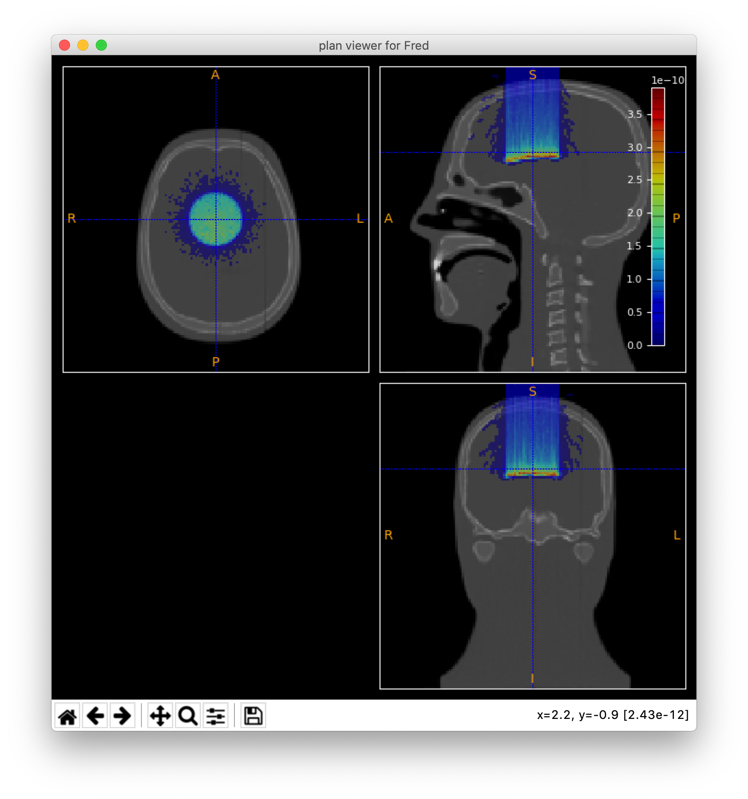

Round beam on a head phantom
=================================

Import the built-in CT scan of an anthropomorphic phantom and deliver a round beam of 100 MeV protons.

Input file:

.. code-block:: python

	# geometry definition
	region: phantom; CTscan=MrHead; pivot=[0.5,0.5,0.0]; O=[0,0,0]; score= Dose

	# source definition
	pbXsec=disc # round cross section with uniform distribution
	pbFWHM=5 # diameter of the beam
	pbE = 100 # energy of beam[MeV]

	nprim=1e5 # no of primary protons to deliver

.. tip::
    `MrHead` is a built-in CT scan at low resolution (2x2x2 mm) of an anthropomorphic phantom that you can use to explore FRED capabilities in tracking particles through a heterogeneous phantom.

Results:

    Dose-Phantom overlay
