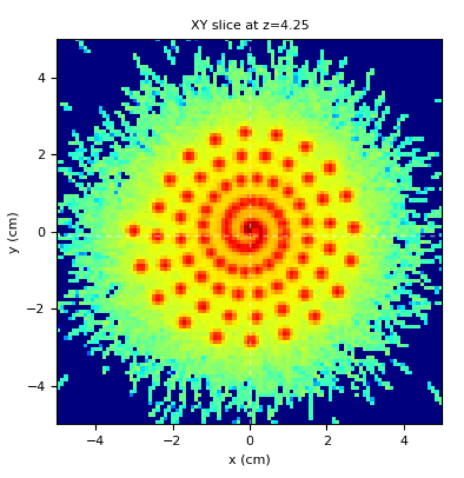

.. _spiralling_spots:

Spiralling spots
=================================

Purpose: to show usage of :ref:`python preparser with meta-input code <python_meta_input>`.

**Meta-input file**

.. literalinclude:: looper.inp

The python preparser generates the following input file (look into  ``out/log/run.inp``):

.. literalinclude:: run.inp

Results:

    here the technique is to keep fixed the main beam and move the phantom after each spot.

    The resulting irradiation pattern on the phantom looks like:

    Irradiation pattern made with spiralling spots (log scale)
