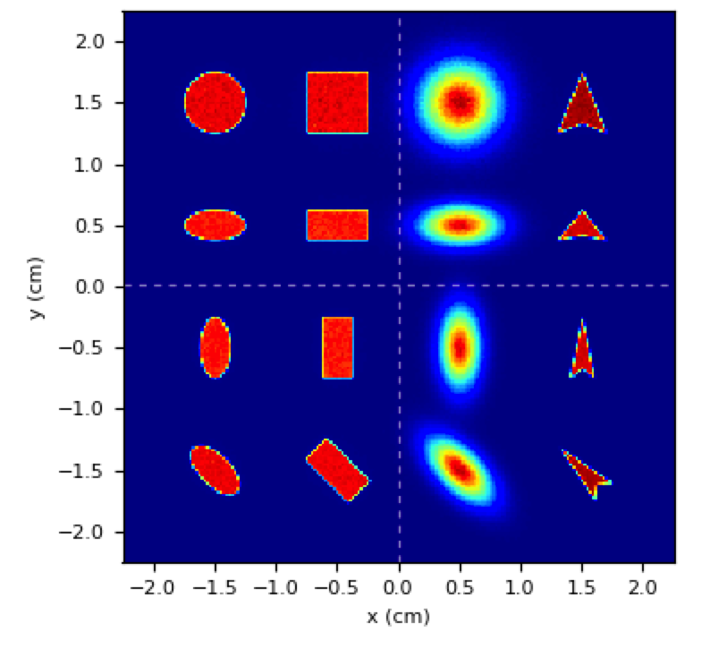

.. _spots_gallery:

Spots gallery
=================================

Purpose: to show manipulation of the cross-section of a spot.

Input file:

.. code-block:: python

	nprim=1e6

	region: phantom ; L=[4.5,4.5,1] ; voxels = [200,200,1] ; pivot=[0.5,0.5,0]

	pb:  1 0 ; P=[-1.5,-1.5,0]; Xsec = disc    ; N = 0.395  ; FWHMx=0.25 ; FWHMy=0.5  ; alpha=45
	pb:  2 0 ; P=[-1.5,-0.5,0]; Xsec = disc    ; N = 0.3792 ; FWHMx=0.25 ; FWHMy=0.5  ; alpha=0
	pb:  3 0 ; P=[-1.5,0.5,0] ; Xsec = disc    ; N = 0.3792 ; FWHMx=0.5  ; FWHMy=0.25 ; alpha=0
	pb:  4 0 ; P=[-1.5,1.5,0] ; Xsec = disc    ; N = 0.79   ; FWHMx=0.5  ; FWHMy=0.5  ; alpha=0
	pb:  5 0 ; P=[-0.5,-1.5,0]; Xsec = box     ; N = 0.5    ; FWHMx=0.25 ; FWHMy=0.5  ; alpha=45
	pb:  6 0 ; P=[-0.5,-0.5,0]; Xsec = box     ; N = 0.48   ; FWHMx=0.25 ; FWHMy=0.5  ; alpha=0
	pb:  7 0 ; P=[-0.5,0.5,0] ; Xsec = box     ; N = 0.48   ; FWHMx=0.5  ; FWHMy=0.25 ; alpha=0
	pb:  8 0 ; P=[-0.5,1.5,0] ; Xsec = box     ; N = 1      ; FWHMx=0.5  ; FWHMy=0.5  ; alpha=0
	pb:  9 0 ; P=[0.5,-1.5,0] ; Xsec = gauss   ; N = 0.6    ; FWHMx=0.25 ; FWHMy=0.5  ; alpha=45
	pb: 10 0 ; P=[0.5,-0.5,0] ; Xsec = gauss   ; N = 0.576  ; FWHMx=0.25 ; FWHMy=0.5  ; alpha=0
	pb: 11 0 ; P=[0.5,0.5,0]  ; Xsec = gauss   ; N = 0.576  ; FWHMx=0.5  ; FWHMy=0.25 ; alpha=0
	pb: 12 0 ; P=[0.5,1.5,0]  ; Xsec = gauss   ; N = 1.2    ; FWHMx=0.5  ; FWHMy=0.5  ; alpha=0
	pb: 13 0 ; P=[1.5,-1.5,0] ; Xsec = uparrow ; N = 0.18   ; FWHMx=0.25 ; FWHMy=0.5  ; alpha=45
	pb: 14 0 ; P=[1.5,-0.5,0] ; Xsec = uparrow ; N = 0.1728 ; FWHMx=0.25 ; FWHMy=0.5  ; alpha=0
	pb: 15 0 ; P=[1.5,0.5,0]  ; Xsec = uparrow ; N = 0.1728 ; FWHMx=0.5  ; FWHMy=0.25 ; alpha=0
	pb: 16 0 ; P=[1.5,1.5,0]  ; Xsec = uparrow ; N = 0.36   ; FWHMx=0.5  ; FWHMy=0.5  ; alpha=0

Results:
	
	Four columns of spots corresponding to `disc`, `box`, `gauss` and `up arrow` cross-sections.

	Variations from top row to bottom row:

	#.	same FWHM ``FWHMx=FWHMy``
	#.	elongated along x ``FWHMx=2*FWHMy``
	#.	elongated along y ``FWHMx=0.5*FWHMy``
	#.	rotate distribution by 45 degree ``alpha=45``

.. code-block:: bash

    mhd_viewer.py out/Dose.mhd

    Spots gallery
