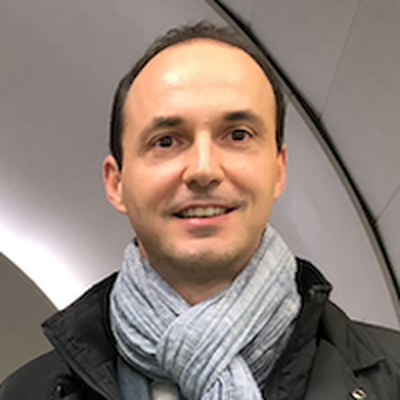
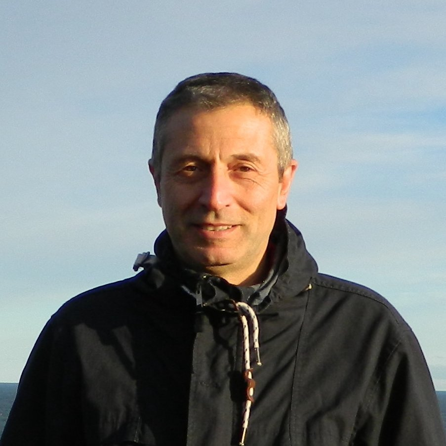
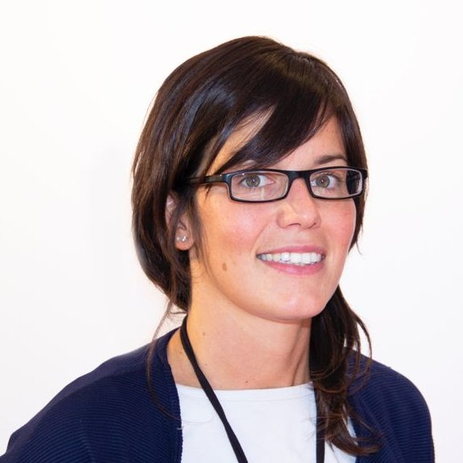

Collaboration
=================================

**Angelo Schiavi** :sup:`1,2`

| :sup:`1` *Department of Basic and Applied Sciences for Engineering, Sapienza University of Rome, Italy*
| :sup:`2` *Istituto Nazionale di Fisica Nucleare (INFN) - Section of Rome, Italy*

| The main developer of FRED code. He is a physicist specialised in modelling and numerical simulations. He is an Associate Professor at Sapienza University where he teaches General Physics in undergraduate courses, and Plasma Physics and Modern Physics in master courses. The most active fields of research are the optimisation of dose deposition in cancer therapy using accelerated charged particles; the study of gain and robustness of capsule implosions in Shock Ignition; the target design for Inertial Confinement Fusion; the generation and transport of fast electrons in dense hot plasma for advanced ignition schemes in fusion energy research; the acceleration and transport of proton beams for plasma diagnostics; the study of electron bunch instabilities in linacs and storage rings. 

|

|

------------

**Vincenzo Patera** :sup:`1,2`

| :sup:`1` *Department of Basic and Applied Sciences for Engineering, Sapienza University of Rome, Italy*
| :sup:`2` *Istituto Nazionale di Fisica Nucleare (INFN) - Section of Rome, Italy*

| FRED developer: nuclear interaction model, electromagnetic interaction model.

|

------------

**Micol De Simoni** :sup:`1,2`

| :sup:`1` *Department of Basic and Applied Sciences for Engineering, Sapienza University of Rome, Italy*
| :sup:`2` *Istituto Nazionale di Fisica Nucleare (INFN) - Section of Rome, Italy*

| My PhD thesis was focused on the development of tools for quality control on therapeutic Carbon beams with FRED. Now, I am doing a postDoc within the Applied Radiation Physics Group (ARPG) in Rome. My research activity is still focused on the development and improvement of models for the interactions of ions with matter in the FRED code.

------------

**Jan Gajewski** :sup:`1`

| :sup:`1` *Institute of Nuclear Physics Polish Academy of Sciences in Kraków, Poland*

| Application of FRED for quality assurance and research in proton radiotherapy, as well as configuration of FRED, specific for a facility, including preparation of beam models. Responsible for new FRED versions testing and validation.

------------

**Magdalena Garbacz** :sup:`1`

| :sup:`1` *Institute of Nuclear Physics Polish Academy of Sciences in Kraków, Poland*

| My role was to test subsequent code versions, validate dose calculations against TPS in CCB, validate calculations of LETd and RBE distributions against publication data/other MC codes. Currently I am analyzing RBE-weighted doses and LETd distributions in studies of the late side effects of proton therapy.

------------

**Antoni Ruciński** :sup:`1`

| :sup:`1` *Institute of Nuclear Physics Polish Academy of Sciences in Kraków, Poland*

| Antoni Ruciński is a medical physics researcher currently working at CCB Krakow proton beam therapy centre at the Institute of Nuclear Physics (IFJ) PAN in Krakow (Poland). His topics of interest range from clinical medical physics, to nuclear physics and radiobiological modeling for radiotherapy applications. He dedicated his research career to the development of computational and experimental methods to reduce physical and biological range uncertainties in clinical proton therapy. Being on the boundary of physics, medicine and biology, he believes that integrated or averaged quantities like dose, LETd and RBE are not the proper quantities to describe the biological effect of charged particles in tissues. Instead, to accurately model radiation effects it is necessary to include the nanoscale effect of DNA damage in particle therapy dosimetry, and eventually apply this approach in charged particle therapy treatment planning.
| Antoni Ruciński graduated from University of Heidelberg in 2013 where he worked on the development of treatment planning strategies for moving targets and especially for prostate cancer patients. During his time in Heidelberg and Heilbronn (Germany), he has been trained as a medical physics expert working in the clinical routine of photon and particle therapy. Between 2015 and 2017 he has been a postdoctoral fellow in Rome at the National Institute of Nuclear Physics (INFN) working on charged secondary radiation produced by ion beams for range monitoring. From 2017 he is based in Krakow and leads research projects with the goals to improve radiobiological modeling and range monitoring in proton beam therapy.

------------

**Ilaria Rinaldi** :sup:`1`

| :sup:`1` *ZonPTC/Maastro Clinic in Maastricht, the Netherlands*

| Ilaria Rinaldi is a proton medical physicist at the MAASTRO Clinic in Maastricht (The Netherlands) since 2018.
| She has pursued pioneering investigations on novel imaging techniques in the field of ion beam therapy with a focus on both, computational and experimental work. She obtained her master degree in medical physics in 2007 from the University of Turin (Italy). During her PhD (2008-2011) at the University of Heidelberg (Germany), she worked on novel imaging techniques in ion beam therapy for future application at Heidelberg Ion Therapy (HIT) center. As post-doctorate at Heidelberg University Clinic/HIT, she continued working on projects related to imaging until 2014. She also performed clinical work in the Heidelberg University Clinic in the Department of Radiation Therapy and Radiation Oncology and at the Heidelberg Ion Therapy Center (HIT). She became "Certified Medical Physicist" in January 2014. In 2014, she was a guest fellow at the Massachusetts General Hospital (MGH) and Harvard Medical School in Boston (USA). Starting from January 2015, she worked as a permanent full-time researcher at the National Center for Scientific Research (CNRS) in Lyon (France).
| In summary, she has a great experience topics around proton therapy from her work in Heidelberg, Boston and Lyon, and in particular, she is experienced in introducing proton therapy in clinical routine. Her main topics of interest and expertise are imaging, radiobiology, and Monte Carlo simulations.

------------

**Nils Krah** :sup:`1,2`

| :sup:`1` *University of Lyon, France*
| :sup:`2` *CNRS/CREATIS, UMR 5220, Lyon, France*

| Contributes to library and API development. Fred for proton imaging and CT conversion for proton dose calculation. Plugin development.

|

|

------------

**Carla Winterhalter** :sup:`1,2`

| :sup:`1` *Centre for Proton Therapy, Paul Scherrer Institute, Switzerland*
| :sup:`2` *Physics Department, ETH Zurich, Switzerland*

| Carla is responsible for FRED applications at the Centre for Proton Therapy, Paul Scherrer Institute (Switzerland). This includes the setup and beam tuning aiming to use FRED for patient specific quality assurance. Additionally, she is planning, supervising and supporting a range of research projects working with FRED at PSI.

|

------------

**Keegan McNamara** :sup:`1,2`

| :sup:`1` *Centre for Proton Therapy, Paul Scherrer Institute, Switzerland*
| :sup:`2` *Physics Department, ETH Zurich, Switzerland*

| Implementation of PET isotope activation models in FRED for use in range verification for proton therapy. Working at Paul Scherrer Institut and ETH Zürich as part of the PETITION project.

|

