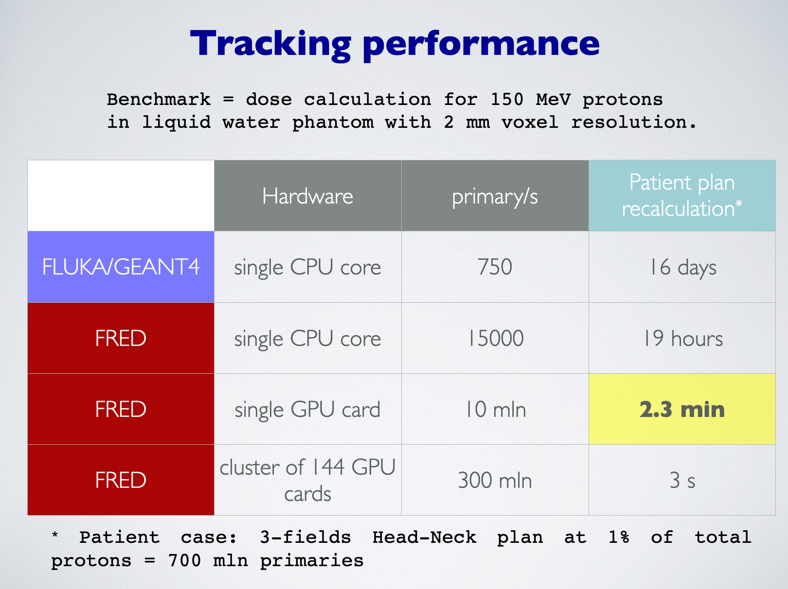

Hardware requirements and Performance Summary
=============================================

FRED can run on a variety of hardware configurations, ranging from laptops, to workstations, to HPC clusters.

When we started developing FRED the goal was to realise a MC dose engine capable of recalculating a whole patient treatment plan in particle therapy within minutes.
This still is our main objective, and the hardware configuration that fits best performance and budget constraints is a workstation equipped with a good CPU and a powerful GPU card.

The main characteristics that affect FRED performance are :

    **main CPU memory (RAM):**

        to hold patient CT information, material properties, and scored quantities 8 GB are the bare minimum for typical clinical cases; **16 GB are recommended**; 32 GB is a good option offering enough perspective for scoring-intensive simulations (e.g. spectra,activation,influence matrix, etc.)

    **local disk space for software installation:**

        the disk footprint of a FRED release is small (typically less than 50 MB); foreseeing a few versions installed on the system, 200 MB of dedicated disk space is more than enough

    **local disk space for simulations:**

        a typical patient recalculation can produce from 500 MB to a few GB depending on grid resolution and no. of activated scorers; the generation of the influence matrix for thousdands of pencilbeams generates typically tens of GB. 
        All in all, a good **SSD of 1 or 2 TB** is a good choice. 

    **main processor (CPU) (simulation initialisation and setup):**

        input file parsing, initialisation and particle start point generation is done by the CPU; many tables are generated at runtime on the CPU: in order to accomplish well this task an *exacore* or *octacore* CPU decently fast (> 3 Ghz base clock frequency) is recommended

    **main processor (CPU) (particle tracking):**

        FRED can track particles in parallel on the CPU using multicore processor capabilities; the tracking rate of a single core is about 20 kprimary/s; scaling of performance is sublinear due to memory bandwith limitations, thermal protection mechanisms, hyper-threading and other similar characteristics of modern multicore CPUs. One can expect to reached up to 150-200 kprimary/s on a high-end processor.

    **GPU card(s) (particle tracking):**

        FRED achieves maximum particle tracking rate on GPU hardware; although the tracking kernel is coded in OpenCL, all development machines at Sapienza Univ. and all present FRED users are using NVidia hardware; in principle AMD GPUs could also run FRED, but no testing hardware is currently in operation. Integrated GPUs on Apple Silicon are not presently supported since years ago Apple discontinued OpenCL support in favor of the proprietary API called Metal.

        Hence presently a good **GPU card from NVidia** is the recommended choice. Note that FRED can drive multiple GPUs on the same workstation, even of different capabilities, by balancing the workload assigned to each card. Performance scaling is almost perfectly linear with no. of GPUs.

        When choosing a GPU card, look at available RAM (at least 8 GB) and peak performance in *single precision floating point* operation (FP32 TFLOPS). Expensive cards of Quadro and/or Tesla series not necessarily will perform better than lower budget consumer cards of the GeForce series.

        Hereafter a brief table with the expected tracking rates for FRED benchmark test:

        .. table:: Tracking rate in primary/s for selected GPU cards

            +--------------------------+----------------+
            | Card Name                |  Tracking rate |
            +==========================+================+
            |  NVIDIA RTX 2080 Ti      |  2.5e6         |
            +--------------------------+----------------+
            |  NVIDIA Titan Xp         |  4e6           |
            +--------------------------+----------------+
            |  NVIDIA RTX A5000        |  5.6e6         |
            +--------------------------+----------------+
            |  NVIDIA RTX 3090         |  7e6           |
            +--------------------------+----------------+
            |  NVIDIA RTX 4090         |  14e6          |
            +--------------------------+----------------+
            

Performance Summary
-------------------
This information is old and out-of-date as soon as it is published: new hardware is coming up and performance of CPU and GPU cards is improving steadily. Hence this table is just an order-of-magnitude summary of the tracking performance one can expect to achieve.

    comparison of tracking performance and typical simulation times for different hardware 

